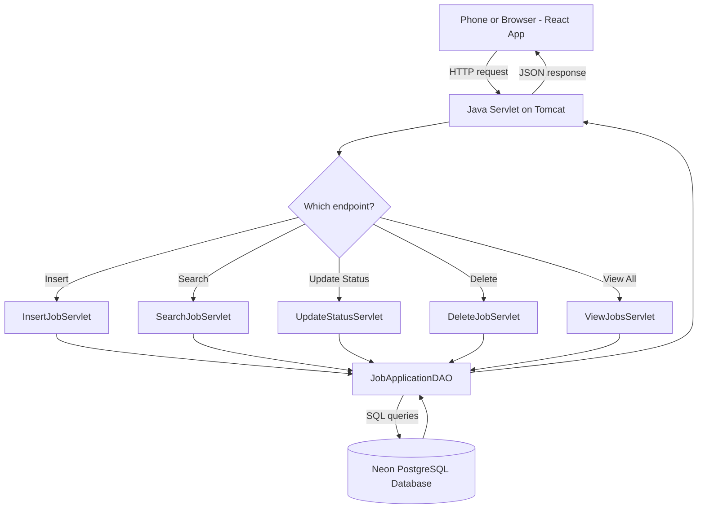

# Job Application Tracker 📋


## Why I made this


During my internship job search I was applying to so many internships every week that honestly made me lost track of everything. I didnt know which company I already applied, I forgot if I sent resume for that Data Analyst role or not, and worst part - when I get rejection email sometimes I dont even remember applying there in first place 😅

I even tried keeping a simple Excel sheet for this at first, but updating it every single time was something I always forget to do, or I get lazy and just skip it for few days, then it get messy and out of date again anyway.

So I decided instead of just complaining about it, I build something to actually solve my own problem. This app let me quickly add a job when I apply, and update the status (interview, accepted, rejected) whenever I hear back. No more guessing, no more losing track.

This is my first real full stack project where I connect everything myself - database, backend, frontend, and deployed it online so I can use it from my phone anywhere, not just at home.


## What it does


- \*\*Add new application\*\* - job title, company, optional job ID, and date (today or pick another date)

- \*\*Search and update status\*\* - find any application by company, title, or job ID, then mark it Interview / Accepted / Rejected

- \*\*View all applications\*\* - color coded so I can see red (rejected), green (accepted), yellow (interview) at a glance, with filter tabs

- \*\*Delete\*\* - remove ones I dont need anymore

- Shows how many days ago I applied, so I know when to follow up


## Tech stack


\*\*Backend:\*\* Java Servlets + JDBC (no framework, just plain Java, this is how I learned it in school)

\*\*Database:\*\* PostgreSQL, hosted free on Neon

\*\*Frontend:\*\* React (built with Vite)

\*\*Deployment:\*\* Docker container running on Render


I wanted to keep everything free and open source since this was a personal project, not something I had budget for.


## How it works (flow)





Basically: I tap something on my phone → React sends a request → Java servlet figure out what to do → DAO run the actual SQL → Postgres database do the work → answer come all the way back to my phone screen.


## Project structure


```

job-tracker/

├── backend/              # Java servlets, connects to postgres

│   ├── src/main/java/com/jobtracker/

│   │   ├── db/           # database connection setup

│   │   ├── model/        # what a "job application" look like

│   │   ├── dao/          # all the SQL code

│   │   ├── servlet/      # handles the web requests

│   │   └── filter/       # CORS stuff

│   ├── Dockerfile

│   └── pom.xml

└── frontend/             # React app

&#x20;   └── src/

&#x20;       ├── App.jsx

&#x20;       └── pages/

```


## Running it yourself


\*\*Backend:\*\*

1\. Set up a free Postgres database on \[Neon](https://neon.tech)

2\. Set `DATABASE\_URL` environment variable to your connection string

3\. `cd backend \&\& mvn clean package`

4\. Deploy the `.war` file to Tomcat, or build the Docker image


\*\*Frontend:\*\*

```

cd frontend

npm install

npm run dev

```


## What I learned building this


This was really my first time connecting a real database (not just SQLite on my laptop) to a backend, and my first time actually deploying something live using Docker instead of just running it on my own computer. I also learn a lot about environment variables and why you should never put password directly in your code - I actually made this mistake first try and had to fix it lol.

Still improving this, next thing I want to add is maybe reminder system so it tell me when I havent heard back from a company in 2 weeks.

